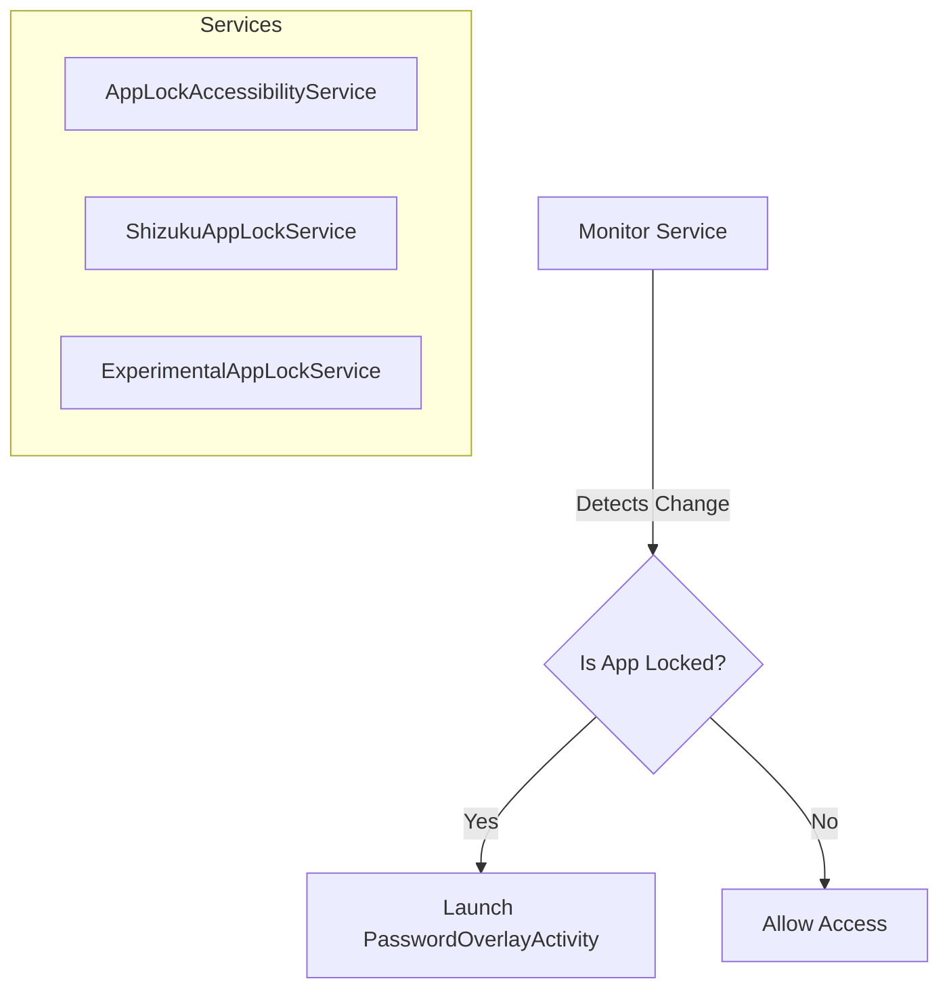

# AppLock Architecture Documentation

This document describes the high-level architecture, core components, and design patterns used in the AppLock application. This documentation serves as a reference for maintenance and future enhancements.

## 1. Overview
AppLock is a security-focused Android application designed to protect other apps with a PIN, pattern, or biometric lock. It employs multiple monitoring techniques (Accessibility, Shizuku) to ensure reliable app tracking and enforcement on various Android versions.

## 2. Technology Stack
- **Language**: Kotlin
- **UI Framework**: Jetpack Compose (Material 3)
- **Monitoring Techniques**:
    - Android Accessibility Services
    - Shizuku/Sui (for elevated system API access)
    - UsageStats API
- **Key Libraries**:
    - `androidx.compose`: Modern UI toolkit.
    - `androidx.biometric`: Biometric authentication.
    - `rikka.shizuku`: Integration with Shizuku for system-level monitoring.
    - `org.lsposed.hiddenapibypass`: Accessing restricted Android APIs.

---

## 3. Project Structure
The project is organized into several modules to separate concerns and reuse components.

### Modules:
- `:app`: The main application module containing features, services, and core logic.
- `:appintro`: Handles the onboarding and introduction screens.
- `:patternlock`: Provides the pattern-based authentication UI components.
- `:hidden-api`: Contains stubs and utilities for interacting with hidden Android system APIs.

### Main Package (`dev.ravargs.applock`):
- `core/`: Cross-cutting concerns like utilities, broadcast receivers, and logging.
- `data/`: Repositories and managers for persistence (preferences, locked apps).
- `features/`: Feature-based architecture (e.g., `applist`, `lockscreen`, `settings`).
- `services/`: Operations running in the background for app monitoring and enforcement.
- `shizuku/`: Logic specific to Shizuku integration.
- `ui/`: Generic UI components and theme definitions.

---

## 4. Core Components & Data Flow

### 4.1. App Monitoring Services
The application provides multiple ways to monitor foreground app changes. The most active service is determined by user permissions and device capabilities.

- **Accessibility Service**: Standard monitoring for non-root users.
- **Shizuku Service**: Uses `IActivityManager` and `IUsageStatsManager` for lower latency and better reliability.

### 4.2. Password Overlay Mechanism
When a locked app is detected, `PasswordOverlayActivity` is displayed over the target application.

- **Mechanism**: Launched with `FLAG_ACTIVITY_NEW_TASK` and `FLAG_ACTIVITY_EXCLUDE_FROM_RECENTS`.
- **Validation**: Once successfully authenticated (PIN/Pattern), the overlay dismisses itself, and the package is temporarily added to a "verified" list to prevent immediate re-locking.

### 4.3. Data Persistence
Data is managed via repositories in the `data` package.

- `AppLockRepository`: Orchestration layer for application state.
- `LockedAppsRepository`: Manages the list of packages that should be locked.
- `PreferencesRepository`: Handles user settings (lock type, theme, service configuration).

---

## 5. Security & Persistence

### 5.1. Anti-Uninstall (Device Admin)
To prevent the app from being easily uninstalled by unauthorized users, AppLock uses the **Device Administrator** API.
- **Location**: `dev.ravargs.applock.core.broadcast.DeviceAdmin`

### 5.2. Persistence after Reboot
- `BootReceiver`: Listens for `BOOT_COMPLETED` to restart monitoring services automatically.
- **Foreground Services**: Services run with "foreground" priority to minimize the chance of being killed by the OS.

### 5.3. Hidden API Bypass
Uses `HiddenApiBypass` to interact with `IActivityManager` and other internal system services, enabling features like monitoring "hidden" window changes that standard APIs might miss.

---

## 6. UI Layer (Jetpack Compose)
The UI follows a modern declarative approach.

- **MainActivity**: Acts as the host for Composable screens (App List, Settings).
- **Features**: Each feature in `features/` typically contains its own UI and ViewModel logic, promoting modularity.
- **Navigation**: Managed via `androidx.navigation.compose`.

---

## 7. Future Enhancements Considerations
- **Lock Profiles**: Allowing different lock types for different apps.
- **Improved Biometric Integration**: Support for more advanced biometric flows (Face ID where available).
- **Stealth Mode**: Ability to hide the application icon or rename it in the launcher.
